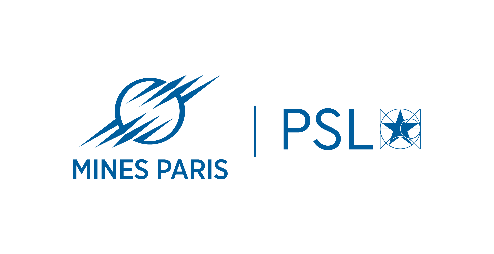
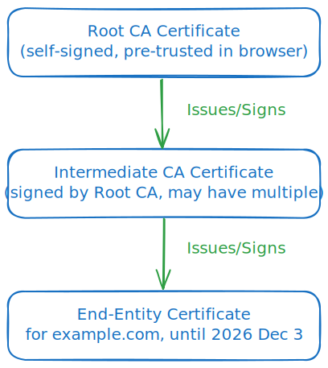
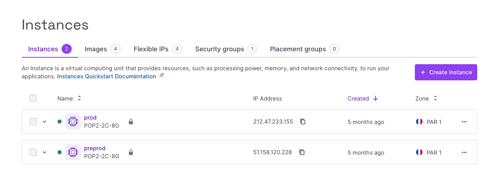

class: middle, slide_title




<!--  -->


# Programmes coopérants 🚀

## Additional slides !

---

layout: true


<!--  -->

<div class="slide_footer">
    <div class="wrap">
        <span>2025 - <i> Réseaux & Backend</i>
        - <a href="slides1.html">1/3: Réseaux</a>
        - <a href="slides2.html">2/3: Coté Serveur!</a>
        - <a href="slides3.html">3/3: Flask</a>
        - <a class="current-slides" href="slides4.html">4: Addendum</a>
    </div>
</div>

---

# 🔐 Web Authentication Techniques

## Session-based Authentication

- User submits login credentials
- Server creates a session and stores it in memory or DB
- Server sends a session ID as a cookie

Example:

```http
POST /login
→ Set-Cookie: session_id=abc123
```
    
Subsequent requests include the session ID:

```http
GET /profile
Cookie: session_id=abc123
```
    
---

## API Key Authentication

- Simple string used to authenticate requests
- Often used for server-to-server communication
- You typically get the API key when you register with the service
  - e.g. google maps, assemblyAI, scaleway, etc..

Example:

```http
GET /data
x-api-key: abc123xyz456
```

---

## Token-based Authentication (JWT)

- User logs in, receives a signed JWT
- Client stores token (e.g., in localStorage)
- Token sent in headers with each request
- Token is parsable and self-contained

Example:

```http
 GET /profile
Authorization: Bearer eyJhbGciOi...
```

---

# 🔗 OAuth 2.0

## 4. OAuth (Delegated Access)

- Used for "Login with Google" / "Login with GitHub"
- User authorizes third-party app via identity provider

Basic flow:

1. App redirects to provider’s auth page
2. User logs in and consents
3. Provider redirects back with a `code`
4. App exchanges code for access token

Example exchange:

```http
POST /oauth/token
→ { "access_token": "abc123" }
```

---

# 🔒 Multi-Factor Authentication (MFA)

## 5. Multi-Factor Authentication

- Adds extra layer beyond just passwords
- Combines two or more of:
  - Something you know (password)
  - Something you have (phone, token)
  - Something you are (biometrics)

Examples:
- SMS or app-based 6-digit codes
- U2F hardware keys (e.g. YubiKey)

    > Enter 6-digit code: 493021

Greatly reduces the risk of compromised accounts

---

## 🔑 Public Key Infrastructure (PKI)

.cols[
  .sixty[

- each browser and OS comes with a list of trusted CAs
  - CA = Certificate Authority
  - in practical terms, their public key
  - e.g. Verisign, Let's Encrypt, etc..
- a certificate is a chain of trust
  - signed by a CA
  - which in turn is signed by another CA
  - and so on until we reach a self-signed root CA
  - which should be trusted by the browser
- like always, signing is based on a public/private key pair
  - the CA signs the certificate with its private key
  - and the browser verifies it with the CA's public key
  ]

.fourty[
  
]
]

.footnote.small[
  try it: in chrome, you can inspect the certificate chain by clicking on the lock icon in the address bar; then choose "Connection is secure" and "Certificate is valid"
]

---

## FastAPI

- similar to Flask on the surface
  - but much more modern !

- fosters a more structured approach
  - uses SQLModel for ORM
  - you can define separate models for creating, reading, updating, etc.
  - useful e.g. for password hashing (not exposed)

- leverages type information (type hints / pydantic)
  - and in particular, automatically generates **interactive documentation**

- has native support for asynchroneous programming

- as well as websockets

---

## Docker: a container engine

- what is a container ? think of it as:

  - a root image (filesystem)
  - a set of processes (process group)
  - a network namespace (IP address)

- in short, it is a *lightwight* virtual machine
  - except that it **shares the kernel** with the host OS

- an app vendor can package their app
  - with all its dependencies
  - and ship it as a container image

- so in pratical terms:
  - instead of running a service inside an OS, you run it **inside a container**
  - e.g. you can run a linux-based nginx server inside a container in a Windows machine
  - **note** there are some gory tricks at work (does WSL rings a bell ?)

---

## CI/CD

### Continuous Integration / Continuous Deployment

- CI/CD is a set of practices that enable development teams to deliver code changes more frequently and reliably

- CI focuses on automating the integration of code changes from multiple contributors into a single software project

- CD automates the deployment of code changes to production

- example : github actions
  - look at the `.github/workflows` folder

- example: readthedocs (continuous documentation)
  - in the numerique course, see the `.readthedocs.yaml` file

---

## Hosting

many online solutions are available for hosting your web apps

- static hosting
  - surge.sh
  - netlify
  - vercel

- CI/CD
  - github pages (often powered by github actions)
  - readthedocs.io
  - ...

---

## Cloud operators

Many operators offer cloud services

- AWS
- Google Cloud
- Azure
- Digital Ocean
- Scaleway
- OVH
- etc..

---

## Cloud offerings

- metal
  - bare metal servers

- instances
  - virtual machines

- kubernetes
  - the substrate is ready for you
  - kube is about **container orchestration**
  - this means you just write yaml files
  - you describe **the state you want to reach**
  - not **the order in which to do things**
  - the kube engine will take care of it
  - offers a huge number of sophisticated features
  - e.g. load balancing, replicas, scaling, ...

k8s has a rather steep learning curve, but very much worth it;  
particularly as it is a standard and you can use it on any cloud provider

---

## Illustration on Scaleway

.cols[
.sixty[
- web console
- docs & the API
- the CLI
- billing
- monitoring
  - prometheus
  - grafana
  - graphQL
]
.fourty[
  

  
]
]

---

## SSH

- the basics:
  - ssh (secure shell) is a protocol for secure remote login over an insecure network
  - it uses public key cryptography
  - its **primary use** is to let you connect to a remote server once it has been provisioned in the cloud

- other uses:
  - you have used it many times when interacting with github
  - it can also be used to create tunnels (like a network pipe) to cross firewalls
  - you can use it with vs-code to edit files on a remote server

- configuration:
  - `~/.ssh/id_rsa`: the **private** key (do **not** show it to anyone)
  - `~/.ssh/id_rsa.pub`: the **public** key (this is the one you share)
  - `~/.ssh/config`: allows to define shortcuts and predefined options per host
  - `~/.ssh/known_hosts`: a list of known hosts and their public keys

---

## firewalls

- a firewall is a network security system that monitors and controls incoming and outgoing network traffic based on predetermined security rules
- typically it is configured to allow or deny traffic based on
  - IP addresses
  - ports
  - and protocols

- typically if you set up a web server in the cloud, you will
  - deny all traffic
  - except TCP incoming traffic on port 22 (SSH)
  - and on port 80 (HTTP) and/or port 443 (HTTPS)

any temporary need (join a debug endpoint on port 9000, for example) can be done
through a SSH tunnel
